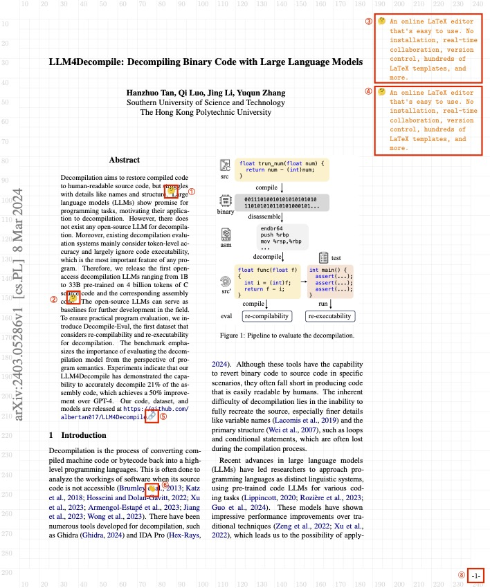

# Try using LaTeX to annotate PDF files!

## Introduction

This LaTeX template can help you attaching annotations and links at a PDF document. Hope that it can be useful when paper reading.

## Advantages

- [x] Cross operating system. (Not dependent on any operating system proprietary PDF browsing software.)
- [x] Cross device. (Especially when using online platforms like Overleaf.)
- [x] Stable. (The Preview of macOS once lost my paper annotations for unknown reasons. LaTeX will never.)
- [x] Good Looking. (And the style can be further customized.)

## Features

<p align="center">
  
  
</p>

| Feature | Explanation | Usage scenarios |
| :-: | :- | :- |
| Annotation | ① and ② used the :thinking: emoji to mark the positions that need to be annotated, while ③ and ④ are sidebar comments. Among them, ① pointed to ③, and ② pointed to ④. Clicking on ①'s emoji will jump to the position of ③. You can define the absolute positions of ① and ②, as well as the contents of ③ and ④ . | |
| URL link | ⑤ used a :link: emoji. Clicking on ⑤'s emoji will jump to an URL. You can define the URL, as well as the absolute positions of ⑤. | You can jump to the URL of related PDF documents, or the code repository. |
| Inner Bi-Link | ⑥ and ⑦ used the <span class="wave">👋</span> emojis and click on each emoji will jump to position of another matching one. You can define the absolute positions for the pairs. | Can be used for linking definitions and citations of the bibliography, figure, or other contents. |
| Page Number | ⑧ and ⑨ are page numbers of the inserted PDF page. |  |
| Background Grid | Our features basically dependent on setting the absolute positions, so background grid with scale was added for convenience. | |

## Usage

Users only need to modify `main.tex` to use. Click [here](https://github.com/zhang-ge-hao/ThesisNotesTemplate/blob/main/main.tex) to review a demo `main.tex`.

### Insert a page

You can insert a page of PDF file using `\pagewithnote` command.

```{LaTeX}
% add page 4 of paper.pdf without any annotations and links.
\pagewithnote{paper.pdf}{4}{}{}{}

% add page 5 of paper.pdf without any annotations and links.
\pagewithnote{paper.pdf}{5}{}{}{}

% add page 6 of paper.pdf without any annotations and links.
\pagewithnote{paper.pdf}{6}{}{}{}
```

### Add annotations

format for one annotation: `*/[position-x]/[position-y]/{[annotation-content]}/*`.

```{LaTeX}
% add page 3 of paper.pdf with 2 annotations.
\pagewithnote{paper.pdf}{3}{
    */95/105/{An online LaTeX editor that's easy to use. No installation, real-time collaboration, version control, hundreds of LaTeX templates, and more.}/*, 
    */145/180/{An online LaTeX editor that's easy to use. No installation, real-time collaboration, version control, hundreds of LaTeX templates, and more.}/*
}{}{}
```

### Add URL links

format for one link: `*/[position-x]/[position-y]/{[URL]}/*`

```{LaTeX}
% add page 1 of paper.pdf with an additional URL, link to a repository.
\pagewithnote{paper.pdf}{1}{}{}{
    */60/210/{https://github.com/albertan017/LLM4Decompile}/*
}
```

## Add Inner Bi-Links

format for a pair of links: 

Side A: `*/[position-x]/[position-y]/[bi-link-name]/A/*`

Side B: `*/[position-x]/[position-y]/[bi-link-name]/B/*`

```{LaTeX}
% add page 1 and page 7 of paper.pdf with a pair of bi-links. click on each emoji will jump to position of another matching one.

\pagewithnote{paper.pdf}{1}{}{
    */75/247/bib1/A/*
}{}

\pagewithnote{paper.pdf}{7}{}{
    */150/100/bib1/B/*
}{}
```
